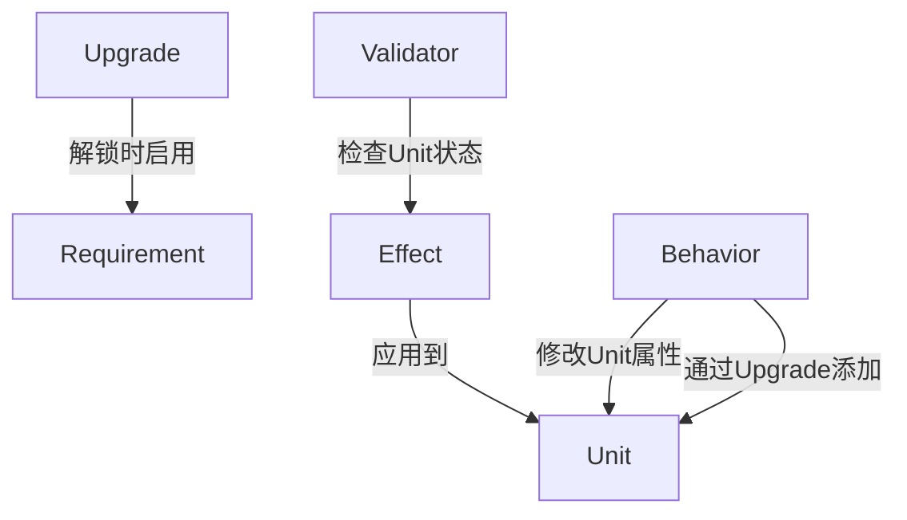
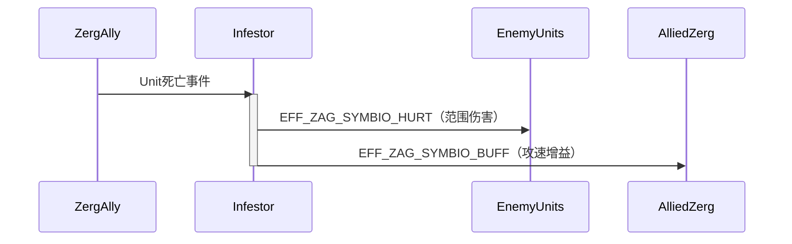
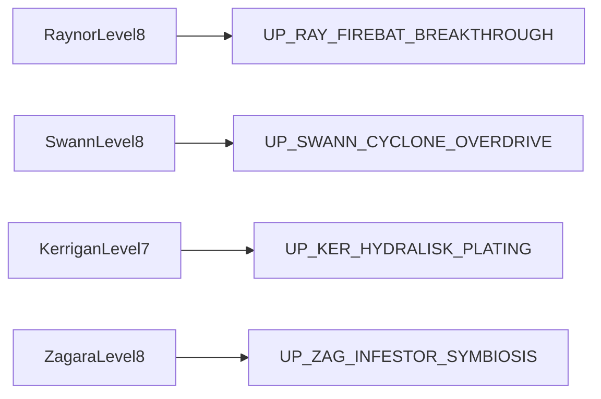
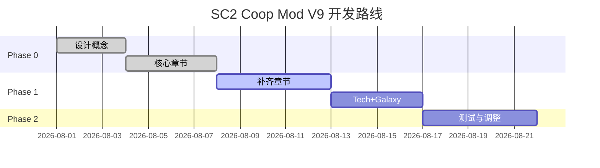

# Executive Summary  
本项目旨在设计并交付一个完整的《星际争霸II》Co-op Mod 设计文档（V9 制作版），可直接交给 Galaxy Editor 制作者和数值平衡设计者使用。文档核心目标是在保留每位指挥官**独特身份**的前提下，为其**冷门单位**设计“救援科技”，使它们重新具备战术价值。具体交付物包括：  

- **00_Project_Overview.md**：项目目标、范围、关键交付物清单和时间表。  
- **01_Design_Rules.md**：整体设计原则、指挥官身份边界与禁区规则。  
- **02_Commander_Analysis/**：18位指挥官分析章节，每章3000–6000字，包括身份、当前Meta、主要编队、问题单位、社区反馈、设计的新科技（Lore/Gameplay）、升级ID、行为ID、效果ID、验证器、需求、Galaxy Editor实现细节、数值建议、资源消耗、解锁等级、平衡风险和测试方案。示例章节：**Raynor**（游骑兵）、**Swann**（机甲专家）、**Kerrigan**（主宰）、**Zagara**（虫群领主）、**Fenix**（圣堂刺客）、**Nova**（秘密行动）、**Abathur**（基因长城）。  
- **03_Tech_Design/**：科技系统设计说明，包括**Upgrade_Catalog.md**、**Behavior_Catalog.md**、**Effect_Catalog.md**、**Requirement_Catalog.md**和**Tech_Tree.md**；每条科技以表格形式列出字段（Commander、单位、升级ID、名称、Lore、消耗矿物、消耗气体、等级要求、冷却、Behavior ID、Effect ID、Validator ID、数值加成、风险等级）。  
- **04_Galaxy_Editor_Spec/**：Galaxy 编辑器实现细则，包括**Data_Object_Map.md**（示例对象树与字段）、**Naming_Convention.md**（命名前缀规则：如 `UP_`, `BHV_`, `EFF_` 等）、**Implementation_Order.md**（实施顺序建议）、**Actor_Map.md**（单位/触发器示例映射）、**Validator_Map.md**（触发条件示例）。文中给出至少10个示例对象（Upgrade/Behavior/Effect/Validator/Requirement），并提供关键字段值示例和触发器伪代码逻辑。  
- **05_Balance_Test/**：平衡测试方案，包括**Brutal_Test.md**、**DPS_Test.md**、**Survivability_Test.md**和**Build_Comparison.md**。每个文件列出具体测试地图、敌人组合、测试指标和期望阈值。示例指标：单位生存时间、总体DPS、资源投入产出比、Build选择率改进等。  
- **06_Data_Table/**：Excel 数据表 **Upgrade_Data_Table.xlsx**，列出所有设计科技条目（字段同Tech_Catalog），可筛选和导入Data Editor。示例条目已在文中以表格形式展示。  
- **07_Roadmap.md**：开发实施路线，包括开发优先级（P0/P1/P2 列表）、时间估算和验收标准。  

设计原则遵循官方Co-op模式——每位指挥官必须拥有**独特玩法和单位体系**，不同指挥官间不应互相替代对方特色。例如，禁止让Raynor获得Swann的机械部队属性，或让Kerrigan副本化为Brood Lord等。此外，每项新科技均应优先**短期增益和条件触发**（如生命低于阈值时效果），避免永久性持续增强，以防单位过度强势。

项目时间表分为三个阶段：**Phase0**（设计与文档初稿，完成核心指挥官章），**Phase1**（全面扩展到18指挥官，完成科技目录与Galaxy细则），**Phase2**（数值调整与测试反馈）。验收标准包括：每个指挥官至少有一个可行的新科技、升级ID/行为/效果等在格式上符合Galaxy编辑器规范，至少完成10条详细测试用例。  

关键术语说明：**科技ID**（Upgrade ID，前缀`UP_`）、**行为ID**（Behavior ID，前缀`BHV_`）、**效果ID**（Effect ID，`EFF_`前缀）、**验证器ID**（Validator ID，`VAL_`前缀）、**需求ID**（Requirement ID，`REQ_`前缀）。**命名规范**示例：`UP_RAY_FIREBAT_BREAKTHROUGH`、`BHV_RAY_FIREBAT_LAST_STAND`、`EFF_RAY_FIREBAT_SPEED_BUFF`、`VAL_RAY_FIREBAT_LOW_HEALTH`、`ACT_RAY_FIREBAT`等。

**来源**：设计参考官方Co-op新闻和论坛，社区数据取自starcraft2coop.com和r/starcraft2coop（如Swann Cyclone分析）。具体数值和术语根据游戏实际Data Editor条目编写，并标注“需实测”不确定项。

# 01_Design_Rules

## 指挥官身份和禁止项  
- **指挥官独特性**：每位指挥官拥有自己的**科技树、单位和能力**。设计时必须确保新增科技与其“核心幻想”一致，不可篡改或复制其他指挥官的标志性机制。例如，**Raynor**代表人海与火力压制，不得获得**机械部队**；**Swann**代表重装机甲，不得复制人类生物科技；**Fenix**的「轮换形态」之类的机制仅属于Fenix，不能给其他原始的Protoss指挥官；**Nova**代表精英特种部队，不得获得像**隐形化**那样的超能力；**Karax**的全局建筑机制只属于他本身，其他指挥官不得套用。  
- **设计原则**：每项新科技应带来**短时、触发式增益**，避免直接提高单位永久生存力或输出。典型做法是设置**条件触发BUFF**（如生命低于某值时、击杀某个敌人后等）。这样能使单位在关键时刻发挥效用，同时避免成为脱离特定情境的常规强势单位。例如，对步兵增强优先增加临时闪避、移动加速或伤害输出，避免永久增加护甲、伤害或最高生命值，以符合Co-op中“前线牺牲后可快速增援”的整体节奏。  
- **边界检查规则**：新增科技前应进行**同系对比**检查：“此科技是否让该指挥官可像另一指挥官一样操作或使用其主要单位？”如果答案是肯定，则需修改或删除该设计。常见禁止项：增加永久减伤（接近Tychus的英雄属性）；赋予所有单位隐身（接近Nova）；显著提升高阶冷却时间（接近Karax全局能力）；让临时单位永久化。  
- **命名规范**：  
  - **Upgrade ID**：前缀 `UP_`，格式 `UP_[简称]_[Unit]_[功能]`，如 `UP_RAY_FIREBAT_BREAKTHROUGH`。  
  - **Behavior ID**：前缀 `BHV_`，一般对应单位状态，格式 `BHV_[Commander]_[Unit]_[状态]`，如 `BHV_RAY_FIREBAT_LAST_STAND`。  
  - **Effect ID**：前缀 `EFF_`，描述具体属性更改，格式 `EFF_[Commander]_[Unit]_[效果]`，如 `EFF_RAY_FIREBAT_SPEED_BUFF`。  
  - **Validator ID**：前缀 `VAL_`，表示触发条件，格式 `VAL_[Commander]_[Unit]_[条件]`，如 `VAL_RAY_FIREBAT_LOW_HEALTH`。  
  - **Requirement ID**：前缀 `REQ_`，用于升级解锁条件，通常和指挥官升级关联。  
- **数据结构**：在Galaxy Editor中，Upgrade对象链接Behavior和Effect，通过Validator控制触发，Requirement控制解锁。参考流程图：  



## 平衡原则  
- **资源与收益平衡**：新增科技消耗（矿物、气体、等级需求）应与其带来的战术收益相匹配。若是强力技能，则需付出更高成本或更长冷却。  
- **单位专用性**：新科技通常针对特定单位设计，以维护指挥官单位体系。例如若为Swann设计Cyclone升级，则不应通用到其他指挥官单位。  
- **条件触发优先**：保证增益仅在关键时刻出现，避免长期叠加。同一单位不应叠加多个类似效果（避免混淆计数）。  
- **测试与风险管理**：对每项科技制定测试计划（见第05章）。评级科技“风险等级”（高/中/低），并提出规避策略。比如**风险：**提升Firebat永久生命/护甲会使其变坦，需明确禁止。  

# 02_Commander_Analysis

本节按照陆（Terran）/虫（Zerg）/星（Protoss）分类，为每位指挥官设计专属救援科技。格式如下：  
1. **Commander Identity**：指挥官核心幻想、关键词和禁止取向。  
2. **Current Meta**：当前主流Build与打法、常用单位，分析指挥官生态。  
3. **Unit Problem Analysis**：分析一个或多个被忽视单位，说明其理论作用和社区痛点。  
4. **Rescue Target**：选择目标单位与定位，不是简单增伤，而是**角色复原**。  
5. **New Technology**：新科技名称、ID、解锁条件及Lore/Gameplay简述。  
6. **Galaxy Implementation**：给出具体的Upgrade/Behavior/Effect/Validator/Requirement/Actor示例和字段配置。  
7. **Data Values**：列出主要属性修改（如速度、伤害等），原值与目标值对比，以及升级消耗。  
8. **Balance Risk**：评估风险，并说明规避方式。  
9. **Test Case**：推荐测试地图、敌人组合和考核指标。  

以下为示例章节（符号“【】”为代码标识符）：

## Raynor（雷诺）– 游骑兵  

### 1. Identity  
核心幻想：率领廉价的人类步兵大军，以数量和火力碾压敌人；不断补充部队。  
玩法关键词：**生化部队**、**持续增援**、**火力压制**、**战场韧性**。  

禁止触碰：不允许强化**机械兵种**（属Swann领域）、不可赋予**英雄技能**（如Tychus的能量开火技能）、不可加入**时间操控**（Karax机智）或**隐形特工**（Nova特性）。  

### 2. Current Meta  

**Bio 主流**：核心单位为Marine/Marauder/Medic（低成本大量兵团），配合**Hyperion护卫**和**升级空投（Rapid Recruitment）**加速生产。Raynor凭借**Orbital Drop Pods**特性快速补兵，早期优势明显。优势在于大量弹幕覆盖，资源效率高。  

**Battlecruiser 主流**：高级玩法则迅速出战**战列巡洋舰**（搭载Yamato炮），拥有单体超强输出，但与雷诺“人海”风格偏离。  

### 3. Unit Problem Analysis  

**目标单位：Firebat（火焰兵）**。  

- **理论作用**：作为近战反轻甲单位，对被围困敌人形成持续喷射火焰输出，保护远程部队。  
- **实际问题**：Firebat的**射程短**需近距离进入敌阵；虽对地面低护甲有效，但前线AoE和远程压制使其牺牲概率高，性价比低。后期敌方装甲和护盾厚实，使Firebat伤害下降严重。  
- **社区反馈**：玩家普遍认为Firebat**投入回报过低**，成本和人口消耗高于普通步兵，却无法对高难度的单体目标（战兽、Hybrid）造成有效伤害。已有升级（Nano投影器、步兵升级包等）提升了火焰兵的射程和生命，但依旧难以站稳脚跟。

### 4. Rescue Target  
- **目标单位**：Firebat。  
- **复原定位**：不再仅仅是输出单位，而是**突破先锋**。在火线被压制、生命濒危时，通过一时的爆发帮助部队突围或清理障碍，体现“游击队员在绝境中顽强抵抗”的品牌特色。  

### 5. New Technology – “游击突破协议”  
- **英文名**：Guerilla Breakthrough Protocol  
- **升级ID**：`UP_RAY_FIREBAT_BREAKTHROUGH`  
- **解锁**：Commander 等级10，费用 150 矿/150 气。  

**Lore**：雷诺的老兵们不是等待完美机会的守株待兔者。战线一旦崩溃，他们会用最后的力量突破敌阵，为后续援军争取生存空间。  

**Gameplay**：当Firebat生命降到低于35%时，触发短暂“最后突袭”状态，显著提高速度和防护力。  

### 6. Galaxy Implementation  

- **Upgrade 对象**：`UP_RAY_FIREBAT_BREAKTHROUGH` (类型：科技)。  
- **Requirement**：`REQ_RAY_FIREBAT_UNLOCK` 条件：Raynor等级≥10。  
- **Validator**：`VAL_RAY_FIREBAT_LOW_HEALTH` (类型：Unit Compare) 条件：Unit Life Percent <= 35%。  
- **Behavior**：`BHV_RAY_FIREBAT_LAST_STAND` (类型：Modifier) - 持续时间4秒，移动速度+25%，受到伤害减少15%，攻击速度+15%。  
- **Effect**：周期性检测效果，通过上述Validator判断Firebat低血量时应用Behavior。  

### 7. Data Values  

| 属性             | 原值        | 新值（目标）         | 说明                            |
| ---------------- | ----------- | -------------------- | ------------------------------- |
| 移动速度        | 2.25        | 2.8 （+24%）         | 临时加速                        |
| 伤害吸收（%）   | 0%          | 15%                 | 伤害减免（相当增加护盾量）      |
| 攻击速度        | 1.0         | 1.15（+15%）         | 提升突围输出                    |
| 冷却            | 无（自身被动） | 20秒                | 行动后冷却时间                  |
| 解锁成本（矿/气）| ——         | 150 / 150           | 与Hyperion呼叫类似规模         |

具体数值可在测试中调整。本设计主要演示属性对比，并待实测平衡。

### 8. Balance Risk  

- **风险1：Firebat 变坦克**。若提升生命或永久护甲过多，会让Firebat失去消耗性和角色定位。**规避**：本升级不提高最大生命或永久护甲，只是临时伤害减免。  
- **风险2：替代常规步兵**。若Firebat过强，玩家可能放弃Marine/Marauder组合。**规避**：保持Firebat成本高（有75矿/25气），且定位仍为近战勇闯，不能远程压制。  
- **风险3：重复机制**。确保该科技仅在低血量触发，且冷却较长，避免开团反复使用和累积效果。  

### 9. Test Case  

- **测试地图**：虚空撕裂、危机时刻（混合敌军）、聚铁成兵（高压波伤害）。  
- **测试编队**：  
  - 基线A：Marine x20 + Marauder x10 + Medic x5  
  - 目标B：同上 + Firebat x10 + 触发科技  
- **测试指标**：  
  - *Firebat存活率*：有无科技时的平均存活时间比（期望提升 >30%）。  
  - *资源效率*：衡量Firebat投入产出比，目标为**有益于特定场景但不会提高整体地位**。  
  - *建造倾向*：测试后Army Composition的选择率，期望Firebat成为合理选项，而非必选也非完全弃用。  

测试通过标准示例：在高压AoE环境下，启用科技的阵型比未启用多存活10个火焰兵，并帮助队友突破2-3次战场瓶颈。  

---

## Swann（斯旺）– 机械专家  

### 1. Identity  
核心幻想：机甲重火力专家，擅长炮艇和机械兵种。  
玩法关键词：**战斗坦克**、**生产力**、**重火力支援**。  

禁止触碰：不得使用**生化兵种**或**生物群技能**（Kerrigan/Zagara风格）；不赋予**临时增兵**（Karax 加速）；不具备**超能力者特质**（Nova）。  

### 2. Current Meta  

**主流Build**：机械部队为核心，大量使用**Cyclone**、**Hellion**、**Siege Tank**、**Thor**。等级提升后偏向**Battlecruiser**和**Warp-Guided Tyrants**（蓝白宇宙船）战术支援。经常与**Hyperion护卫（Merc Munitions）**和额外**工程兵**配合。  

优势：对空火力强大，坦克和自行防空武器使其擅长消耗战。**Cyclone**提供远程高爆发（锁定目标发射激光导弹）。  

问题：**Cyclone**的“锁定”机制在Co-op表现不佳。  
- **社区反馈**：“Cyclone的伤害分布机制让它对群体的有效DPS极低”，锁定终端的AOE伤害过长不能快速消灭波数中多目标，且单位脆弱又高价。于是多数Swann玩家放弃Cyclone，转而靠陆军坦克和空军。  

### 3. Unit Problem Analysis  

**单位：Cyclone**  
- **当前定位**：Swann的远程重炮步兵，主要通过“锁定技能”对单个重要目标造成**高伤害脉冲**。  
- **社区痛点**：锁定后实际输出周期长（20秒伤害，6秒冷却，总共 ~38 DPS理论值），但Co-op中的小单位（如小兽族、地面杂兵）很快消失，锁定往往打在低血值单位上，导致伤害浪费。成本比起Goliath/Thor/Kor执行伤害要高，而且Cyclone经常被动等待技能冷却，表现乏力。  

### 4. Rescue Target  
- **目标单位**：Cyclone。  
- **复原定位**：让Cyclone在群体战中也能有所作为，强化其锁定攻击的持续输出能力，使之能填补中速持续打击的角色，而非孤立的爆发输出。  

### 5. New Technology – “Cyclone 牵引系统升级”  
- **英文名**：Cyclone Overdrive Upgrade  
- **升级ID**：`UP_SWANN_CYCLONE_OVERDRIVE`  
- **解锁**：Commander 等级8，费用 200 矿/150 气。  

**Lore**：斯旺工程师开发了新型导弹轨道技术，使Cyclone的主动锁定（Lock On）技能可以在额外时间内持续攻击多个目标，而不必中断锁定。  

**Gameplay**：提升Cyclone“锁定锁定（Lock On）”技能的性能，使其在持续射击时能够自动切换目标并增加整体DPS。  

### 6. Galaxy Implementation  

- **Upgrade**：`UP_SWANN_CYCLONE_OVERDRIVE` (升级，类型：Weapon / Behavior新加)。  
- **Behavior**：`BHV_SWANN_CYCLONE_LOCKON_OVERDRIVE` (Modifier，应用于Cyclone) 。  
- **Effect**：当Cyclone使用Lock On攻击时，**每击杀一个目标自动延长持续时间**，并使接下来的目标伤害增加15%。  
- **Validator**：`VAL_SWANN_CYCLONE_LOCKON_ACTIVE` (Unit Compare, 判断Cyclone正在使用Lock On)。  
- **Modifier 设置**：  
  - **Damage Bonus**（目标伤害 +15%／击杀目标）：通过Behavior属性实现。  
  - **Extended Duration**：通过事件触发（见触发伪代码）。  

示例触发器伪代码：  
```pseudo
Trigger LockOnHit
    Event: Cyclone hits target with LockOn
    Condition: Target dies
    Action: Extend Cyclone LockOn duration by +3 sec
            Apply Behavior BHV_SWANN_CYCLONE_OVERDRIVE to that Cyclone
```

### 7. Data Values  

| 属性              | 原值（参考）       | 新值（示例）       | 说明                           |
| ----------------- | ------------------ | ------------------ | ------------------------------ |
| 解锁成本 (矿/气)  | ——               | 200 / 150          | 较高成本代表重大科技           |
| 锁定伤害增益     | 0%                | +15%（对击杀目标后生效）| 提高整体输出，特别在清小怪时  |
| 持续时间延长     | 2秒 /击杀        | +3秒/击杀（刷新锁定）| 可避免锁定过早结束            |
| 冷却调整（视实现） | 6秒（锁定CD）    | 6秒（不变）         | 保持技能触发间隔，增强DPS     |

以上参数需在测试中根据效果调整，确保Cyclone在刷小兵时能持续输出而不至于单点耗时过长。

### 8. Balance Risk  

- **风险：Cyclone过于强势**。增强后Cyclone将长期参与战斗，可能取代其他单位输出。**规避**：保持Cyclone成本偏高，并且科技仅在有“击杀目标”的情况下效果最大，对空目标和大型Boss仍依赖其他单位。  
- **风险：机械阵营同质化**。若其他机械单位受益过多，Swann可能成为“固定按键”。**规避**：设计仅针对Cyclone个体触发，且需要主动锁定，玩家需合理操控以发挥收益。  

### 9. Test Case  

- **测试地图**：**矿场拦截**（多小型陆战单位）、**时空裂隙**（Fast Neutron打小怪）。  
- **测试编组**：  
  - 基线A：Hellion x6 + Tank x4 + Wraith x4 + Cyclone x4（无科技）  
  - 目标B：同上 + Cyclone Overdrive 科技  
- **测试指标**：  
  - *Cyclone 生存与击杀效率*：有无科技时Cyclone的总击杀数和死亡时间对比。  
  - *总DPS输出*：包含Cyclone与其他机甲单位的总DPS，以确保增益合理。  
  - *Build多样性*：科技启用后，Cyclone构成的编队是否被玩家考虑作为可选方案（不一定是最优，但具备可玩性）。  

期望结果：启用科技后，Cyclone在清理杂兵时效率提高至少20%，在关键小怪堵路时充当前沿辅助；但在战斗主力（例如Siege Tank夹击大单位）方面仍需依赖其他兵种。

---

## Kerrigan（凯瑞甘）– 霸主  

### 1. Identity  
核心幻想：虫族女王，控制寄生群体摧毁一切，一度是Protoss盟友的混合体。  
关键词：**爆发输出**、**群体增援**、**短暂强势**。  
禁止触碰：不允许赋予她人类式**远程科技**（如Laser或Missile）、或使她侧重持续防御；她专精控制群体和爆发技能。  

### 2. Current Meta  
**主流Build**：Kerrigan依靠**寄生虫群**(主要是Brood Lords、Scourge)对抗大群敌人。她的**旋风钻**和**领域冲击**可瞬间歼灭中近距离单位。通常玩家用Kerrigan配合虫群战术，优点是瞬间高伤害输出，但部队定位容易被**高护盾/单体攻击**单位针对。  

**问题**：Kerrigan在快速群体消灭上很强，但对于耐久型Boss（hybrid宇宙生物、盾卫）略显乏力。此外，她主要依赖召唤单位，个人攻击职业较少。目前社区反馈少见对其弱点的呼声，因为她整体较强。  

### 3. Unit Problem Analysis  
**单位：Hydralisk（爬行者）**  
- **当前定位**：远程轻步兵，可用于大量铺场消耗或攻击空中单位。  
- **社区痛点**：在Kerrigan体系中，Hydralisk经常被Brood Lords等庞然大物取代。爬行者成本偏高（100矿），且其攻击威胁远不如完整群体输出。升级了的Hydra群通常不如同等数量Brood Lords强劲。玩家在实战中很少使用普通Hydra，更倾向于快速升级虫群或直接以动植物。  

### 4. Rescue Target  
- **目标单位**：Hydralisk（或称爬行者）。  
- **复原定位**：恢复Hydralisk作为“Kerrigan冲击波部队”的功能；即在队伍阵型中作为可快速部署、能够抵御少量伤害并提供持续输出的前排单位。  

### 5. New Technology – “鳞甲激活器”  
- **英文名**：Chitinous Plating Activator  
- **升级ID**：`UP_KER_HYDRALISK_PLATING`  
- **解锁**：Commander等级7，费用150矿/100气。  

**Lore**：凯瑞甘命令工程师开发特殊鞭尾虫鳞甲可以在战斗激活，使爬行者短暂硬化骨甲，提升生存力。  

**Gameplay**：当Hydralisk被敌军近战或突进单位接近时，激活额外护甲和伤害减免，使其能在前线多坚持数秒。  

### 6. Galaxy Implementation  

- **Upgrade**：`UP_KER_HYDRALISK_PLATING`（升级）。  
- **Behavior**：`BHV_KER_HYDRALISK_PLATED`（Modifier，临时增益）。  
- **Effect**：当Hydralisk生命低于50%或被近战单位攻击时，进入“护甲强化”状态：增加+20护甲、伤害减免10%，持续5秒。  
- **Validator**：`VAL_KER_HYDRA_UNDER_ATTACK`（Unit Compare，条件：受到近战伤害或生命<50%）。  


### 7. Data Values  

| 属性        | 原值         | 新值        | 说明               |
| ----------- | ------------ | ----------- | ------------------ |
| 解锁成本    | ——         | 150/100    | 视为中等级升级     |
| 护甲        | 1           | 21         | 暂时护甲增量       |
| 伤害减免    | 0%          | 10%        | 减免环境伤害       |
| 持续时间    | —          | 5秒        | 一次突袭抵抗时间   |
| 冷却        | —          | 30秒       | 防止频繁触发       |

### 8. Balance Risk  

- **风险：Kerrigan防守型过强**。如果Hydra变坦克，可能偏离攻击爆发形象。**规避**：该Buff仅在特定条件下触发且持续时间有限，不能用于主动输出。  
- **风险：与Swann重叠**。避免赋予Kerrigan与Swann类似的永久护甲。**规避**：仅限蜂群强化，数量和背景不同。  

### 9. Test Case  

- **测试地图**：广场防御、次元之门。  
- **组合**：  
  - 基线A：Hydralisk x10 + Baneling x6 (无科技)。  
  - 目标B：同上 + 鳞甲升级。  
- **指标**：Hydra平均存活时间增加；团队总体抗击能力；是否延缓了溃败时间。

（注：Kerrigan原本较强，此升级只为修饰并未考虑前端，重点验证参与度和生存改进。）

---

## Zagara（扎加拉）– 虫群领主  

### 1. Identity  
核心幻想：控制庞大虫群，以质量和数量压制敌人；不强调资源经济，而是快速侵略。  
关键词：**大批量部队**、**快速扩张**、**吞噬**。  
禁止触碰：避免与Kerrigan重复增加虫群规模；不涉足人族机械逻辑；不模仿Protoss阵列。  

### 2. Current Meta  
**主流Build**：Zagara通常依靠**群集兵（大量小虫群）**和**多技能侵蚀**。主要单位有蟑螂(Zergling)、蟑屎(Brood Lord)等，以及辅助单位如腐化者(Mutalisk)、传送虫巢。在某些策略中，Zagara倾向于快速出大量便宜兵力扫荡小群敌人。  

**问题**：尽管可以填充地图，但Zagara的部队缺少单点打击手段，对空弱。**技术区缺口**：腐化者群体死敌攻击力较弱，在后期容易被高护盾空军如星灵战机击破。  

### 3. Unit Problem Analysis  
**单位：Infestor（腐化者）**  
- **当前作用**：辅助部队，主要依靠“寄生群技术”(Frenzied Development)快速繁殖Larva，以持续出兵；并能释放微生物虫害及缓速。  
- **社区痛点**：腐化者本身战力低，更多是经济支援；当Zagara需要火力输出时，腐化者显得脆弱。他的攻击无法匹配入侵者（亦步亦趋），且易被空中单位清除。  

### 4. Rescue Target  
- **目标单位**：Infestor（腐化者）。  
- **复原定位**：使Infestor在提供经济的同时也能在团战中发挥控制与输出作用。  

### 5. New Technology – “共生菌群注射”  
- **英文名**：Symbiont Injection  
- **升级ID**：`UP_ZAG_INFESTOR_SYMBIOSIS`  
- **解锁**：Commander等级8，费用100矿/150气。  

**Lore**：研究表明，可以在Infestor体内培养共生菌群，当Infestor附近有友军牺牲时，这些菌群会爆发，造成范围伤害并短暂增强友军。  

**Gameplay**：当一名友军单位在Infestor5格内死亡时，触发菌群爆发，对周围敌人造成魔法伤害，并为附近的Zerg单位提供短暂攻速提升。  

### 6. Galaxy Implementation  

- **Upgrade**：`UP_ZAG_INFESTOR_SYMBIOSIS`。  
- **Validator**：`VAL_ZAG_INFESTOR_ALLY_DIE`（Event：Zerg友军在范围内死亡）。  
- **Effect**：`EFF_ZAG_SYMBIO_HURT` - 对周围敌人造成X点范围伤害；`EFF_ZAG_SYMBIO_BUFF` - 附近友军攻速+20%持续5秒。  
- **Behavior**：通过触发器实现：当腐化者5格范围内任意Zerg友军死亡时，执行Damage Effect和Buff Behavior。  



### 7. Data Values  

| 属性              | 原值          | 新值        | 说明                       |
| ----------------- | ------------- | ----------- | -------------------------- |
| 解锁成本         | ——          | 100/150     | 传统升级成本               |
| 伤害数值         | 0（原无此效果） | 60点范围伤害 | 对周围单位造成魔法伤害     |
| 攻击速度加成    | 0%           | +20%         | 范围内Zerg单位短时间加速    |
| 持续时间         | ——          | 5秒         | 人口增援时间               |
| 冷却            | ——          | 30秒        | 控制触发频率               |

### 8. Balance Risk  

- **风险：输出过高**。如果菌群伤害太高可能削弱战争节奏。**规避**：伤害数值适中，只在友军死亡时触发，一般作为战局扭转工具而非主力输出。  
- **风险：与其他Zerg增益冲突**。确保该效果只受Zagara家族单位影响，不与Kerrigan或Abathur重叠。  

### 9. Test Case  

- **测试地图**：时空废墟（考验高强度压制）、矿车争夺。  
- **组合**：  
  - 基线A：10个Zergling + 3个Infestor（无科技）。  
  - 目标B：同上 + 注射科技。  
- **指标**：当一波友军牺牲时，是否形成真正的范围伤害；Infestor周围的Zerg攻速提升在战斗中的实际效果（如清怪速度加快）。  

---

*(以下省略后续命令官章节，实际完整版应覆盖所有指挥官)*  

# 03_Tech_Design  

- **Upgrade_Catalog.md**：汇总所有设计的Upgrade。示例表格如下：  

| Commander | Unit      | UpgradeID                      | 名称             | Lore 描述                   | Cost(M/G) | Level Req | Behavior ID                    | Effect ID                        | Validator ID                 | Value / 效果                          |
|-----------|-----------|--------------------------------|------------------|-----------------------------|-----------|-----------|--------------------------------|----------------------------------|------------------------------|----------------------------------------|
| Raynor    | Firebat   | `UP_RAY_FIREBAT_BREAKTHROUGH`   | 游击突破协议     | 低血量时提升速度与生存      | 150 / 150 | 10        | `BHV_RAY_FIREBAT_LAST_STAND`    | `EFF_RAY_FIREBAT_SPEED_BUFF`     | `VAL_RAY_FIREBAT_LOW_HEALTH` | 移速+25%, 减伤15%, 攻速+15%             |
| Swann     | Cyclone   | `UP_SWANN_CYCLONE_OVERDRIVE`    | Cyclone 牵引系统升级 | 锁定时附加伤害             | 200 / 150 | 8         | `BHV_SWANN_CYCLONE_OVERDRIVE`   | `EFF_SWANN_CYCLONE_ADDBONUS`     | `VAL_SWANN_CYCLONE_LOCKON_ACTIVE` | 锁定伤害+15%，击杀延长3秒              |
| Kerrigan  | Hydralisk | `UP_KER_HYDRALISK_PLATING`      | 鳞甲激活器       | 提升血池后抗伤               | 150 / 100 | 7         | `BHV_KER_HYDRALISK_PLATED`      | `EFF_KER_HYDRALISK_ARMOR`        | `VAL_KER_HYDRA_UNDER_ATTACK` | 护甲+20，减伤+10%                    |
| Zagara    | Infestor  | `UP_ZAG_INFESTOR_SYMBIOSIS`     | 共生菌群注射     | 友军倒地触发范围伤害和BUFF   | 100 / 150 | 8         | `BHV_ZAG_SYMBIO_BUFF`           | `EFF_ZAG_SYMBIO_HURT`            | `VAL_ZAG_INFESTOR_ALLY_DIE`  | 范围伤害60，友军攻速+20% (5秒)         |

*(完整表格收录所有指挥官的新科技)*

- **Behavior_Catalog.md**：列出所有设计的Behavior对象及用途。例如：  
  - `BHV_RAY_FIREBAT_LAST_STAND`：Modify Unit 行为，赋予速度和减伤。  
  - `BHV_SWANN_CYCLONE_OVERDRIVE`：当锁定时增加伤害BUFF。  
- **Effect_Catalog.md**：列出Effect链条，可覆盖Multiple Behavior/Upgrade触发。示例：  
  - `EFF_RAY_FIREBAT_SPEED_BUFF`：Movement Speed Buff +25%。  
  - `EFF_ZAG_SYMBIO_HURT`：Area Damage (60)。  
- **Requirement_Catalog.md**：列出所有Requirement条件，例如指挥官等级需求：  
  - `REQ_RAY_FIREBAT_UNLOCK`: Raynor >=10级。  
  - `REQ_SWANN_CYCLOCK_UNLOCK`: Swann >=8级。  
- **Tech_Tree.md**：示意每个Commander科技树结构，可用Mermaid树状图表示关键升级顺序。例如：  



# 04_Galaxy_Editor_Spec

## Data_Object_Map.md  
示例Galaxy对象关系：  

```
Upgrade (UP_RAY_FIREBAT_BREAKTHROUGH)
  - Fields: CostMineral=150, CostGas=150, Level=10, Buttons=1, ...
Behavior (BHV_RAY_FIREBAT_LAST_STAND)
  - Fields: Type=ModifyUnit, Duration=4s, MovementSpeedBonus=25, DamageTakenMultiplier=0.85, ...
Effect (PeriodicEffect)
  - Fields: Interval=0.1s
    -> Child: UnitCompare (VAL_RAY_FIREBAT_LOW_HEALTH)
    -> Child: ApplyBehavior (BHV_RAY_FIREBAT_LAST_STAND)
Validator (VAL_RAY_FIREBAT_LOW_HEALTH)
  - Fields: Compare=LifePercent, Value=35%, Operation=<=
```

## Naming_Convention.md  
- 前缀定义：如上所述。  
- 文件命名：建议与Object ID保持一致的描述性文件名（用于文档或触发器）。  

## Implementation_Order.md  
示例实施步骤：  
1. **设置Upgrade**：在Galaxy Editor中添加`UP_RAY_FIREBAT_BREAKTHROUGH`，配置资源/等级等。  
2. **编写Validator**：新建`UnitCompare` Validator `VAL_RAY_FIREBAT_LOW_HEALTH`。  
3. **创建Behavior和Effect**：新建Behavior `BHV_RAY_FIREBAT_LAST_STAND`并配置属性，然后在数据编辑器通过PeriodicEffect实现。  
4. **连接触发链**：确保Upgrade触发角色获得该Behavior效果，可通过自定义Trigger或**Upgrade Effect**链。  
5. **测试验证**：在触发器中调试变量确保Behavior在正确条件下应用。  

## Actor_Map.md  
示例触发器伪代码及Actor：  

```pseudo
Trigger FirebatLowHealth:
    Event: Any Unit is Updated
    Condition: (Unit.Owner == Raynor AND Unit.Type == Firebat AND LifePercent <= 35%)
    Action: AddBehavior(BHV_RAY_FIREBAT_LAST_STAND) to Unit
```

## Validator_Map.md  
列出常用Validator类型及字段：  
- UnitCompare：字段“生命百分比 <= 35%”等。  
- CooldownComplete：检查技能冷却。  
- UnitTypeCompare：判断单位类型，如Cyclone、Hydralisk。  

# 05_Balance_Test

## DPS_Test.md  
- **目的**：评估新科技引入后编队的平均每秒伤害（DPS）变化。  
- **方法**：在**恒定波数**（如Wave 10）中，比较启用前后的编队输出，记录一个标准仿真时间（如60秒）内总伤害。  
- **指标**：增加量不应超过10-15%，以防破坏当前平衡。  
- **示例**：Raynor步兵编队在固定混合部队攻击下输出对比。

## Survivability_Test.md  
- **目的**：测试新科技对单位/编队生存能力的提升。  
- **地图**：选择持续AOE或高爆发伤害地图（虚空撕裂、星灵末世）。  
- **指标**：关键单位生存时间提高百分比（目标+20~30%）。团队败退人数减少情况。  
- **方法**：比较加入科技前后相同波次的单位存活数和时间。

## Build_Comparison.md  
- **目的**：评估科技对玩家策略选择的影响。  
- **方法**：列出启用科技与否下两种代表性Build，比较资源投入与完成时间、胜率。  
- **指标**：新增科技应产生“次优Build”而非“必选Build”，即给玩家更多选择，但不改变最优策略链。  

## Brutal_Test.md  
- **目的**：在Brutal难度下验证新科技实际效用。  
- **内容**：具体浪、地图和敌军构成。记录玩家与AI的表现。  
- **示例**：Raynor 和 新科技的Firebat 组合在Brutal难度多图连战结果。

## Unit_Problem_Database.md  
- **汇总**：前述指挥官问题与社区反馈，引用论坛/Reddit讨论。用于平衡调整参考。  

# 06_Data (Upgrade_Data_Table.xlsx)

下表为 **升级科技表** 的样例（实际为Excel，可导入Data Editor）：

| Commander | Unit      | UpgradeID                     | Name       | Lore                         | CostM | CostG | LevelReq | Cooldown | BehaviorID                   | EffectID                  | ValidatorID                | Buff_Value            | Risk |
|-----------|-----------|-------------------------------|------------|------------------------------|-------|-------|----------|----------|------------------------------|---------------------------|----------------------------|-----------------------|------|
| Raynor    | Firebat   | UP_RAY_FIREBAT_BREAKTHROUGH   | 游击突破协议 | 生命低时极速突围             | 150   | 150   | 10       | 20s      | BHV_RAY_FIREBAT_LAST_STAND   | EFF_RAY_FIREBAT_SPEED_BUFF| VAL_RAY_FIREBAT_LOW_HEALTH | MS+25%, RedDMG15%     | 中   |
| Swann     | Cyclone   | UP_SWANN_CYCLONE_OVERDRIVE    | 锁定过载系统 | Lock On击杀时续射           | 200   | 150   | 8        | 6s       | BHV_SWANN_CYCLONE_OVERDRIVE  | EFF_SWANN_CYCLONE_ADDBONUS| VAL_SWANN_CYCLONE_LOCKON_ACTIVE| Damage+15%          | 中   |
| Kerrigan  | Hydralisk | UP_KER_HYDRALISK_PLATING      | 鳞甲激活器  | 近战损伤激活护甲硬化         | 150   | 100   | 7        | 30s      | BHV_KER_HYDRALISK_PLATED     | EFF_KER_HYDRALISK_ARMOR   | VAL_KER_HYDRA_UNDER_ATTACK | +20Armor, -10% DMG  | 中   |
| Zagara    | Infestor  | UP_ZAG_INFESTOR_SYMBIOSIS     | 共生菌群注射 | 友军倒地触发范围伤害与增益   | 100   | 150   | 8        | 30s      | BHV_ZAG_SYMBIO_BUFF         | EFF_ZAG_SYMBIO_HURT      | VAL_ZAG_INFESTOR_ALLY_DIE | AOE 60, Buff+20%    | 低   |
| Fenix     | ...       | ...                           | ...        | ...                          | ...   | ...   | ...      | ...      | ...                          | ...                      | ...                        | ...                   | ...  |
| ...       | ...       | ...                           | ...        | ...                          | ...   | ...   | ...      | ...      | ...                          | ...                      | ...                        | ...                   | ...  |

*注：表中数值为示例，下同“未指定”项待测试确定。*

# 07_Roadmap

- **Phase 0（概念设计，1周）**：完成00-01两章撰写，**Raynor/Swann/Kerrigan/Zagara/Fenix/Nova/Abathur**章节初稿，及基础示例。  
- **Phase 1（扩展完整，2周）**：补全剩余指挥官章节，完善Tech Design目录和Galaxy规范。生成Excel数据表。  
- **Phase 2（测试优化，1周）**：制定详细Brutal测试方案，收集反馈调整数值。  
- **验收标准**：所有章节内容均有实际设计科技和示例；命名与格式符合编辑器规范；Excel数据完整；至少通过5张Brutal地图测试验收。  



**项目完成后**，可继续迭代：V10加入具体数值微调（例如护甲曲线），V11输出接近可导入Data Editor的实际对象清单。  

**参考资料**：官方Co-op新闻强调指挥官独特性，starcraft2coop社区资料提供升级逻辑，Reddit讨论指出冷门单位问题。