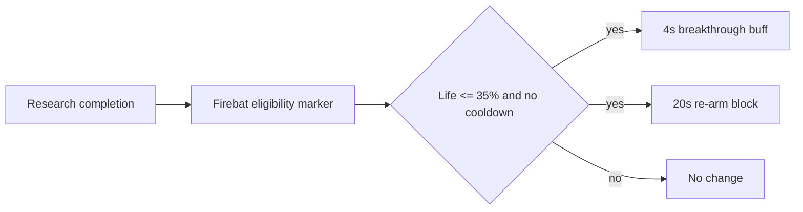

# Cooperation Underused-Unit Rescue Technology Design

## Status and Scope

| Item | Value |
| --- | --- |
| Status | Design baseline; not implemented or balance-validated |
| Source | `docs/plans/deep-research-report (3).md` |
| In scope | Eighteen commander-level candidate designs; four normalized from the source report and fourteen added as research candidates |
| Out of scope | Import-ready XML, target-package catalog IDs, and a production balance claim |
| Intended consumers | Commander-mod implementers, map-adapter implementers, and balance-test owners |

This document turns the supplied research draft into an implementation-ready
design baseline. It preserves the useful design intent while separating three
different kinds of statements:

- **Design**: an approved direction to evaluate, not a claim about live Co-op.
- **Static verification required**: a catalog id, inheritance path, or schema
  field that must be checked in the target package before implementation.
- **Runtime validation required**: a balance or gameplay outcome that cannot be
  established from source inspection.

The supplied draft contains four actual commander proposals. This specification
adds fourteen candidates to make the catalog complete at the design layer. The
fourteen additions are explicitly labeled as research candidates: they provide
an implementation and test hypothesis, not a verified claim that the selected
unit is currently underused or that its proposed mechanism exists in the target
package.

## Design Objective

Each rescue technology should restore a narrow tactical role for an underused
unit without replacing the commander's defining army, calldown, hero, or macro
mechanic. The preferred mechanism is a bounded, conditional benefit rather
than a permanent increase to all combat statistics.

### Guardrails

1. Keep effects commander- and unit-specific. Do not generalize a rescue
   technology into a shared mod until at least two real consumers need the same
   behavior.
2. Prefer an existing data-driven effect chain. Use Galaxy only when the
   required event, target handoff, or state cannot be expressed by supported
   catalog objects.
3. Give every repeated trigger an explicit cooldown or a non-stacking behavior.
   The trigger condition must also define re-arm behavior.
4. Treat costs, commander-level gates, baseline values, and numeric targets as
   proposed values until the target commander package proves its actual catalog
   and the runtime test produces comparable evidence.
5. Keep canonical commander behavior in its commander mod. Map-specific
   compatibility belongs in a map adapter; it is not a reason to change a
   canonical package.

### Evidence Model

| Claim | Required evidence |
| --- | --- |
| Unit, ability, and behavior ids exist in the target composition | `static`: source catalog trace plus schema validation |
| Upgrade appears on the intended command card and is gated correctly | `runtime`: launched target composition and captured command-card/state evidence |
| Trigger fires once, respects cooldown, and affects only intended units | `runtime`: controlled assertion scenario and same-window ScriptError verdict |
| A unit becomes a viable optional choice without becoming mandatory | `runtime`: repeated matched combat/build tests with recorded inputs and outcomes |

## Coverage Matrix

| Commander | Rescue target | Proposed technology | Design status |
| --- | --- | --- | --- |
| Raynor | Firebat | Guerilla Breakthrough Protocol | Detailed candidate |
| Swann | Cyclone | Lock-On Overdrive | Detailed candidate; event implementation needed |
| Kerrigan | Hydralisk | Chitinous Plating Activator | Detailed candidate; numbers require reduction test |
| Zagara | Infestor | Symbiont Injection | Detailed candidate; event implementation needed |
| Nova | Hellbat | Breach-Suit Recalibration | Research candidate |
| Han and Horner | Widow Mine | Salvage Detonation Link | Research candidate; area-hit accounting required |
| Tychus | Cannonball | Momentum Plating | Research candidate; damage-window accounting required |
| Mengsk | Sky Fury | Airspace Priority Doctrine | Research candidate; target/ability closure required |
| Abathur | Devourer | Reactive Spore Metabolism | Research candidate |
| Dehaka | Primal Swarm Host | Pack Pursuit Reflex | Research candidate; summon lifecycle filtering required |
| Stukov | Infested Diamondback | Tethered Advance Doctrine | Research candidate; target continuity required |
| Stetmann | Mecha Corruptor | Stetzone Charge Relay | Research candidate; Stetzone state closure required |
| Artanis | Scout | Targeting Lattice Recalibration | Research candidate |
| Vorazun | Centurion | Shadowline Countercharge | Research candidate; mobility-ability closure required |
| Karax | Energizer | Phase-Power Relay | Research candidate; power-field recipient selection required |
| Alarak | Havoc | Target Lock Relay | Research candidate; target-link closure required |
| Fenix | Disruptor | Purifier Displacement Protocol | Research candidate; multi-hit accounting required |
| Zeratul | Shield Guard | Void Shard Counterpulse | Research candidate |

## Catalog and Naming Contract

The source draft's `UP_`, `BHV_`, `EFF_`, `VAL_`, and `REQ_` names are design
handles, not verified game ids. They use a legacy prefix convention and must be
namespaced to the owning mod before writing XML to prevent catalog collisions.

Suggested package-local form:

```text
<PackagePrefix>_<Commander>_<Unit>_<Role>
```

For example, a mod with the `CMRE` prefix could use
`CMRE_RaynorFirebatBreakthrough` for the upgrade and
`CMRE_RaynorFirebatBreakthroughBuff` for its behavior. The final prefix must
follow the target package's existing IDs; do not introduce a second naming
system in an established commander mod.

The implementation must verify the exact target unit and ability IDs in the
target package's `Base.SC2Data/GameData` catalog. Generic references such as
`Firebat`, `Cyclone`, `Hydralisk`, and `Infestor` identify design intent only;
Co-op variants can inherit from, rename, or replace base-game entries.

## Candidate Technology Catalog

| Commander | Unit role to restore | Candidate upgrade | Proposed gate and cost | Trigger and bounded effect | Key risk |
| --- | --- | --- | --- | --- | --- |
| Raynor | Firebat as a short-range breach unit | Guerilla Breakthrough Protocol | Level 10; 150M/150G | At <=35% life, once per 20s: 4s speed, attack-speed, and damage-taken buff | Becomes a general-purpose durable infantry core |
| Swann | Cyclone as a mobile sustained-damage option | Lock-On Overdrive | Level 8; 200M/150G | A Lock On kill grants a small, capped continuation benefit | Requires reliable kill ownership and target state handoff |
| Kerrigan | Hydralisk as a disposable pressure force, not a tank line | Chitinous Plating Activator | Level 7; 150M/100G | Under defined pressure, 5s defensive pulse, once per 30s | Armor proposal is too large without testing |
| Zagara | Infestor as a swarm-combat support unit | Symbiont Injection | Level 8; 100M/150G | Nearby allied unit death produces a rate-limited enemy pulse and allied haste | Death-heavy loops can scale without a strict cap |
| Nova | Hellbat as a brief elite breach escort | Breach-Suit Recalibration | Research/price TBD | A short personal breach state after verified close engagement | Must not duplicate Nova's cloak or make a permanent tank |
| Han and Horner | Widow Mine as deliberate anti-wave setup | Salvage Detonation Link | Research/price TBD | A qualifying mine detonation leaves one bounded local follow-up effect | Must not create chain-detonation or universal Han unit damage |
| Tychus | Cannonball as a deliberate engagement anchor | Momentum Plating | Research/price TBD | A capped personal response to a measured enemy-damage window | Must not erase outlaw positioning or cooldown decisions |
| Mengsk | Sky Fury as a purposeful air-response choice | Airspace Priority Doctrine | Research/price TBD | A capped anti-air continuation after a qualifying air kill | Must not replace artillery or make every target a valid chain |
| Abathur | Devourer as a mobile anti-air control option | Reactive Spore Metabolism | Research/price TBD | Repeated verified hits on one air target grant a brief control effect | Must not become permanent anti-air crowd control |
| Dehaka | Primal Swarm Host as a pack-pressure option | Pack Pursuit Reflex | Research/price TBD | One non-expiry summon action per host can create a short rush window | Summon expiry and multiple hosts must not create a loop |
| Stukov | Infested Diamondback as a moving single-target pressure unit | Tethered Advance Doctrine | Research/price TBD | Continuous qualifying attacks grant a short personal mobility window | Must not change its core attack contract or create permanent kiting |
| Stetmann | Mecha Corruptor as a Stetzone-dependent air responder | Stetzone Charge Relay | Research/price TBD | A charged state from verified Stetzone presence powers one short air-combat window | Must not function off-grid or stack through overlapping zones |
| Artanis | Scout as a focused air-control choice | Targeting Lattice Recalibration | Research/price TBD | A brief focus window after verified air-target engagement | Must not displace Artanis's broader army roles |
| Vorazun | Centurion as a surgical engage tool | Shadowline Countercharge | Research/price TBD | A short post-engage personal state after the real mobility ability resolves | Must not copy permanent cloak or make charge safe at all times |
| Karax | Energizer as a deliberate support-positioning unit | Phase-Power Relay | Research/price TBD | One deterministic friendly recipient gains a short field-derived benefit | Must not become an army-wide permanent stat aura |
| Alarak | Havoc as an explicit focus-fire support choice | Target Lock Relay | Research/price TBD | A target-link completion creates one local, short continuation benefit | Must not multiply through several Havocs or bypass sacrifices |
| Fenix | Disruptor as a tactical wave-control choice | Purifier Displacement Protocol | Research/price TBD | A qualifying multi-hit resolution grants one bounded follow-up state | Must not turn area damage into an unconditional cooldown reset |
| Zeratul | Shield Guard as a timing-sensitive defensive escort | Void Shard Counterpulse | Research/price TBD | A shield-threshold event creates one personal defensive counterpulse | Must not grant the army a permanent artifact-scale defense |

M means minerals and G means vespene gas. Commander-level gates are only
applicable if the target composition has a verified way to expose that
progression; a normal `CRequirement` does not, by itself, prove access to a
Co-op commander level.

## Raynor: Guerilla Breakthrough Protocol

### Design Intent

Firebats should have a situational role at the front of a Raynor infantry push:
they create a short breach window after reaching critical health, rather than
becoming permanently durable or replacing Marines and Marauders.

### Candidate Contract

| Field | Proposed value | Verification note |
| --- | --- | --- |
| Upgrade handle | `UP_RAY_FIREBAT_BREAKTHROUGH` | Rename to the target package convention |
| Trigger | Life percent <= 35% | Define whether it triggers on threshold crossing only |
| Behavior | `BHV_RAY_FIREBAT_LAST_STAND` | Use a non-stacking buff with a 4s duration |
| Effect | +25% move speed, +15% attack speed, 15% damage reduction | Confirm supported behavior modifications in the actual schema/catalog |
| Re-arm | 20s | Must start only after activation; damage over time must not retrigger it |
| Cost | 150M/150G | Balance candidate, not an established price |

### Data-First Implementation Shape

Use a target-package upgrade/research path to grant an owner or unit marker.
From that marker, a periodic or damage-response effect chain should test the
life threshold and absence of the cooldown behavior, then apply both the active
buff and cooldown buff. The concrete behavior, effect, and validator subtypes
must be copied from a known working pattern in the target package and validated
against `catalogsData.xsd`.



### Acceptance Tests

1. A full-health Firebat receives no bonus.
2. Crossing the threshold produces one buff instance and one cooldown marker.
3. Repeated damage during the 4s window does not stack or refresh the active
   buff.
4. Healing above 35% does not clear the cooldown.
5. A mixed Marine/Marauder/Medic control group retains its normal behavior.

## Swann: Lock-On Overdrive

### Design Intent

The proposal aims to reduce Lock On's wasted time against disposable targets.
It must not turn Lock On into uncontrolled multi-target damage or make Cyclones
replace the commander's tank and air roles.

### Candidate Contract

| Field | Proposed value | Verification note |
| --- | --- | --- |
| Upgrade handle | `UP_SWANN_CYCLONE_OVERDRIVE` | Rename to the target package convention |
| Qualifying event | A Cyclone's active Lock On kills its target | Verify ability, effect, and kill-owner IDs |
| Reward | +3s continuation and +15% Lock On damage | Cap the continuation; do not automatically retarget without an explicit design decision |
| Cooldown | Inherit Lock On cooldown initially | Re-evaluate only after baseline runtime measurement |
| Cost | 200M/150G | Balance candidate |

### Implementation Decision

The draft described an event trigger. That is appropriate only if the data
catalog cannot reliably identify both the Lock On source and its killed target.
Before adding Galaxy, inspect the target ability's existing persistent/effect
chain and look for a data-driven kill or behavior-removal hook. If Galaxy is
required, it must store a unit-local marker when Lock On begins, validate the
marker and owner at death, apply a capped behavior to the original Cyclone, and
clear stale markers on cancel, death, or timeout.

The phrase "automatically switch target" is intentionally excluded from the
baseline. It changes the player's targeting contract and needs a separate,
runtime-tested design decision.

### Acceptance Tests

1. Killing a target with an ordinary weapon produces no reward.
2. Killing the active Lock On target produces one reward for the originating
   Cyclone only.
3. Cancelled Lock On, a killed Cyclone, and an expired Lock On produce no late
   reward.
4. Consecutive qualifying kills cannot exceed the documented cap.
5. Boss-target time-to-kill and a mixed-wave clear rate remain inside the
   agreed balance envelope.

## Kerrigan: Chitinous Plating Activator

### Design Intent

Hydralisks receive a short defensive pulse while under defined pressure. The
goal is to preserve their ability to keep firing in a fragile army, not to
convert them into a durable frontline core.

### Candidate Contract

| Field | Proposed value | Verification note |
| --- | --- | --- |
| Upgrade handle | `UP_KER_HYDRALISK_PLATING` | Rename to the target package convention |
| Trigger | Life <=50% after recent enemy damage | "Near melee unit" is ambiguous; use a measurable condition |
| Active behavior | 5s defensive pulse | Must be non-stacking and paired with cooldown state |
| Initial test range | +2 to +4 armor *or* 10% damage reduction | The source's +20 armor is not a safe starting value |
| Re-arm | 30s | Runtime-test against healing and repeated AOE |
| Cost | 150M/100G | Balance candidate |

### Rationale for the Revised Test Range

Armor interacts with rapid low-damage attacks and can reduce incoming damage far
more than a flat percentage reduction. A temporary +20 armor proposal cannot be
treated as a minor survivability buff. Begin with a smaller, single defensive
axis, record effective health and time alive against representative attack
types, then adjust from measured outcomes.

### Acceptance Tests

1. The pulse triggers once from the chosen threshold/pressure condition.
2. Ambient damage, self-damage, and allied damage do not qualify.
3. The pulse neither stacks nor refreshes before re-arm.
4. The measured survival gain is compared separately against low-damage swarms,
   burst attacks, and armor-piercing damage.
5. The upgraded army remains meaningfully weaker at holding a line than a
   purpose-built defensive composition.

## Zagara: Symbiont Injection

### Design Intent

An Infestor near a collapsing swarm converts a limited amount of attrition into
a brief local counterattack window. It should reward positioning, not make
disposable unit loss an unlimited damage engine.

### Candidate Contract

| Field | Proposed value | Verification note |
| --- | --- | --- |
| Upgrade handle | `UP_ZAG_INFESTOR_SYMBIOSIS` | Rename to the target package convention |
| Qualifying event | Allied, non-temporary Zerg combat unit dies within 5 range | Verify owner, alliance, category, and temporary-unit filters |
| Enemy result | Small area-damage pulse | Start below the source's 60-damage proposal and test by enemy type |
| Ally result | 5s local attack-speed buff | Must be non-stacking or refresh-only |
| Global per-Infestor cap | One trigger per 30s | Needed to stop death-loop amplification |
| Cost | 100M/150G | Balance candidate |

### Implementation Decision

This mechanism requires an event source with access to the dead ally, the
nearby Infestor, and nearby recipients. Prefer a supported data-driven death
response if the target package already has one. Otherwise, implement a narrow
Galaxy trigger owned by the commander package. It must filter unit ownership,
alliance, race/category, distance, and temporary or summoned units before it
applies the pulse. It must select a deterministic Infestor policy when more
than one eligible Infestor is nearby, such as nearest eligible Infestor only.

### Acceptance Tests

1. Enemy, neutral, non-Zerg, temporary, and out-of-range deaths do not trigger
   the effect.
2. A qualifying death selects exactly one eligible Infestor.
3. Multiple deaths inside the cooldown do not emit additional pulses.
4. Allies receive at most the documented haste behavior; overlapping Infestors
   do not multiply attack speed.
5. A fixed swarm-wave test records both trigger count and total added damage.

## Terran Research Candidates

The following candidates were added after the supplied report. They are
commander-identity hypotheses derived from the local Co-op commander reference;
each target's actual availability, data inheritance, and baseline viability
must be traced before any implementation starts.

### Nova: Breach-Suit Recalibration

**Target hypothesis:** Hellbats can become a selective short-range breach escort
for Nova's small elite force without receiving permanent survivability.

| Contract element | Candidate |
| --- | --- |
| Qualifying state | A target-package Hellbat has taken enemy damage while an enemy is within a verified short range |
| Result | One 3-4s personal move-speed and damage-reduction state; no cloak, no effect transfer to other units |
| Re-arm | 25-30s personal cooldown |
| Implementation preference | Data-driven recent-damage/range validators; Galaxy only if the existing package has no supported recent-damage state |
| Failure signal | The state can be triggered safely outside a real close engagement or makes Hellbats the default Nova frontline |

Acceptance: verify eligibility is limited to the actual Nova Hellbat variant;
confirm one activation per cooldown; compare an elite mixed army with and
without the candidate against a close-range anti-light wave.

### Han and Horner: Salvage Detonation Link

**Target hypothesis:** Widow Mines can reward deliberate placement with one
bounded post-detonation zone rather than a raw damage increase for Han's army.

| Contract element | Candidate |
| --- | --- |
| Qualifying event | A verified owner-controlled Widow Mine detonates and hits at least one valid enemy |
| Result | One short, small-radius enemy slow or damage-over-time zone at the resolved detonation point |
| Re-arm | The mine's normal lifecycle; the zone never creates another mine event |
| Implementation preference | Data effect chain using the actual detonation effect; Galaxy only if hit accounting is unavailable |
| Failure signal | Zone damage can trigger additional mines, applies to invalid targets, or becomes reliable boss damage |

Acceptance: prove a mine that misses creates no zone, a hit creates exactly one
zone, overlapping detonations remain independent, and a standard air-focused
Horner composition is unchanged.

### Tychus: Momentum Plating

**Target hypothesis:** Cannonball can gain a short, visible engagement window
after absorbing a bounded amount of enemy damage, preserving the player's
positioning and healer decisions.

| Contract element | Candidate |
| --- | --- |
| Qualifying event | A single Cannonball reaches a target-package measured enemy-damage threshold inside a short time window |
| Result | One 4s personal movement/mitigation state, with no heal, taunt, or ally-wide effect |
| Re-arm | 25-30s personal cooldown |
| Implementation preference | Existing accumulated-damage behavior if present; otherwise a narrow Galaxy counter that clears on timeout, death, and revive |
| Failure signal | Self, environmental, or allied damage qualifies; the state trivializes outlaw focus-fire risk |

Acceptance: distinguish burst from slow incoming damage; prove only Cannonball
receives the result; verify deaths/revives cannot leave a stale counter or buff.

### Mengsk: Airspace Priority Doctrine

**Target hypothesis:** Sky Fury can become a deliberate anti-air choice through
a capped continuation reward after an air kill, without improving ground siege
or artillery identity.

| Contract element | Candidate |
| --- | --- |
| Qualifying event | A validated Sky Fury attack/effect kills a valid air unit |
| Result | One short personal attack-speed or retarget-readiness state against air only |
| Re-arm | 15-20s, with one reward active at a time |
| Implementation preference | Trace the actual Sky Fury weapon/effect chain before selecting data or Galaxy implementation |
| Failure signal | Ground targets qualify, several units multiply the state, or the reward has unlimited air-wave uptime |

Acceptance: record air and ground kill paths separately; confirm boss targets
cannot create a reward without a qualifying kill; compare anti-air clear time
and non-air output against the baseline.

## Zerg Research Candidates

### Abathur: Reactive Spore Metabolism

**Target hypothesis:** Devourers can offer mobile anti-air control through a
short, non-stacking response to sustained fire on one air target.

| Contract element | Candidate |
| --- | --- |
| Qualifying state | The same valid air target has received a small, verified number of Devourer hits within a fixed window |
| Result | A short target-local slow or vulnerability behavior with a per-target immunity window |
| Re-arm | Target immunity 15-20s; behavior cannot stack |
| Implementation preference | Existing weapon/effect counters first; Galaxy only if target-hit ownership cannot be represented |
| Failure signal | Different Devourers stack the effect indefinitely or the effect controls ground/boss units outside its contract |

Acceptance: prove hit ownership and target filters; test two Devourers on one
target and one Devourer across two targets; measure whether air-control uptime
stays inside the stated immunity rule.

### Dehaka: Pack Pursuit Reflex

**Target hypothesis:** A Primal Swarm Host can create a temporary pack-pursuit
moment when it produces a valid non-expiry summon action, without converting
summon expiration into a resource loop.

| Contract element | Candidate |
| --- | --- |
| Qualifying event | A validated host launches its normal summon action, not a summoned unit's death or expiry |
| Result | One 4-5s personal/pack-local movement window for the host and its newly created, linked summons only |
| Re-arm | One use per host action, gated by the base ability's actual cooldown |
| Implementation preference | Parent ability/effect trace plus summon-link data; Galaxy only if link identity is unavailable |
| Failure signal | Expiry, duplicate hosts, or unrelated summons can refresh the state |

Acceptance: distinguish cast, spawn, death, and expiry events; verify only the
newly linked units benefit; test several hosts without cross-host state leakage.

### Stukov: Tethered Advance Doctrine

**Target hypothesis:** Infested Diamondbacks can sustain a mobile single-target
pressure role if a verified continuous attack sequence grants one brief personal
mobility response.

| Contract element | Candidate |
| --- | --- |
| Qualifying state | The same valid target is hit by the same Diamondback for a bounded continuous window |
| Result | One 3s personal movement or turn-rate bonus; no automatic target acquisition |
| Re-arm | Target switch, attack interruption, or 20s cooldown clears the sequence |
| Implementation preference | Trace the real attack/weapon persistence contract before choosing effect or Galaxy state |
| Failure signal | Attacking different targets preserves the sequence or the bonus enables permanent kiting |

Acceptance: test target switching, movement interruption, death, and target
death; compare the unit's sustained uptime without changing its ordinary
single-target damage budget.

### Stetmann: Stetzone Charge Relay

**Target hypothesis:** Mecha Corruptors can contribute a short air-combat
window only when genuinely supported by Stetzone state, reinforcing rather than
replacing the commander's positioning system.

| Contract element | Candidate |
| --- | --- |
| Qualifying state | A verified Mecha Corruptor remains in a valid owner-controlled Stetzone for a fixed charge interval |
| Result | One short anti-air behavior after the charge completes; leaving the zone before completion cancels the charge |
| Re-arm | 20-30s personal cooldown; overlapping zones do not accelerate charge |
| Implementation preference | Reuse the target package's actual Stetzone behavior/validator closure |
| Failure signal | The charge completes off-grid, stacks through zones, or buffs ground combat |

Acceptance: test entry, exit, zone ownership, overlap, and destroyed zone
states; record charge time and air-only result in a controlled air wave.

## Protoss Research Candidates

### Artanis: Targeting Lattice Recalibration

**Target hypothesis:** Scouts can regain a focused anti-air niche through one
short response to a sustained air-target engagement, without displacing the
commander's broad conventional army.

| Contract element | Candidate |
| --- | --- |
| Qualifying state | The same valid air target receives a small verified hit sequence from one Scout |
| Result | A 3-4s personal firing-stability or attack-speed behavior against air only |
| Re-arm | 15-20s personal cooldown and no stacking |
| Implementation preference | Data hit-counter/target validator if supported; otherwise a narrow source-target Galaxy state |
| Failure signal | Ground targets qualify, many Scouts multiply a single target debuff, or the benefit becomes permanent |

Acceptance: verify air-only filters, target-switch reset, and no change to
ground damage; compare a mixed anti-air army against a capital-air control.

### Vorazun: Shadowline Countercharge

**Target hypothesis:** Centurions can be a deliberate surgical engage unit when
their real mobility ability resolves against an eligible target, not a general
permanent defensive unit.

| Contract element | Candidate |
| --- | --- |
| Qualifying event | The target package's actual charge/dash effect completes on a valid enemy target |
| Result | A single 3s personal melee-speed or damage-reduction state |
| Re-arm | 20s personal cooldown; cancelled or blocked movement grants nothing |
| Implementation preference | Extend the existing mobility effect chain; do not replace it with a generic unit-update trigger |
| Failure signal | Manual movement, cloaking, or failed charge creates the state; repeated dashes stack it |

Acceptance: record successful, cancelled, path-blocked, and target-death charge
paths; check that permanent cloak remains separate from the candidate state.

### Karax: Phase-Power Relay

**Target hypothesis:** Energizers can gain a positioning-sensitive support role
by relaying a short benefit to exactly one deterministic recipient inside their
real power-field contract.

| Contract element | Candidate |
| --- | --- |
| Qualifying event | The target package confirms a valid support/power-field action on an eligible allied unit |
| Result | One 4s recipient-local shield recharge or movement state; not an army-wide aura |
| Re-arm | 15-20s per Energizer; the same recipient can hold one behavior only |
| Implementation preference | Target package support ability/effect chain; Galaxy only for a missing deterministic recipient policy |
| Failure signal | Several Energizers multiply a target effect, out-of-field units qualify, or a passive global aura appears |

Acceptance: test one and multiple candidate recipients, overlapping Energizers,
field loss, and invalid ownership; measure recipient benefit separately from
whole-army performance.

### Alarak: Target Lock Relay

**Target hypothesis:** Havocs can be made a more legible focus-fire support
choice by completing an existing target-link loop with a short, local benefit
instead of a broad damage increase.

| Contract element | Candidate |
| --- | --- |
| Qualifying state | The actual Havoc target-link/lock is active on a valid enemy and at least one eligible linked ally engages it |
| Result | One short, non-stacking local benefit to the linked ally group or the Havoc, selected by target-package evidence |
| Re-arm | Link loss or 15-20s cooldown ends the effect |
| Implementation preference | Reuse the real target-lock behavior and target reference; do not infer a link from proximity alone |
| Failure signal | Multiple Havocs multiply the result or the effect survives link/target loss |

Acceptance: test link creation, loss, target death, and two-Havoc overlap; verify
the candidate does not bypass Alarak's sacrifice and positioning constraints.

### Fenix: Purifier Displacement Protocol

**Target hypothesis:** Disruptors can become a controlled wave-management
choice when a real multi-hit purification effect resolves, but may not gain an
unconditional reset or repeated burst chain.

| Contract element | Candidate |
| --- | --- |
| Qualifying event | The target package's actual area effect hits a documented minimum number of valid enemies |
| Result | One short personal cooldown-recovery or shield-stability behavior, capped to one per cast |
| Re-arm | Bound to the base ability's cooldown or an additional 20-30s guard |
| Implementation preference | Trace the real effect set and hit accounting; Galaxy only if the area effect exposes no countable result |
| Failure signal | One target qualifies, several effects count each other, or repeated casts reset the base ability |

Acceptance: measure one-, threshold-, and over-threshold-hit cases; verify one
reward per cast and no effect against invalid/dead targets after resolution.

### Zeratul: Void Shard Counterpulse

**Target hypothesis:** Shield Guards can serve as timing-sensitive defensive
escorts if crossing a verified shield threshold produces one modest local
counterpulse without copying Zeratul's global artifact power.

| Contract element | Candidate |
| --- | --- |
| Qualifying event | A valid Shield Guard crosses a specified shield threshold from enemy damage |
| Result | One 3s personal or very small-radius defensive counterpulse; no permanent artifact scaling |
| Re-arm | 25-30s personal cooldown and no re-trigger through shield recharge alone |
| Implementation preference | Existing shield/damage response behavior first; Galaxy only for an unsupported threshold-crossing event |
| Failure signal | Recharging across the threshold qualifies, allied/self damage qualifies, or overlapping guards amplify indefinitely |

Acceptance: test threshold crossing, shield recovery, shield bypass, owner,
alliance, and overlap; compare the escort's survival effect without changing
Zeratul's artifact progression.

## Implementation Sequence

1. Select one commander package and verify its current source branch, write
   scope, composition manifest, and Co-op dependencies.
2. Trace the real target unit, its research location, its relevant ability, and
   existing behaviors/effects in `Base.SC2Data/GameData`.
3. Copy the nearest working pattern into a package-local feature file; register
   it through that package's existing `GameData.xml` include structure.
4. Validate the precise XML against `catalogsData.xsd`; do not use illustrative
   field labels from this document as schema names.
5. Run the package's static catalog/dependency checks.
6. Execute a deterministic control scenario for the trigger, cooldown, target
   filters, and non-stacking contract.
7. Launch only through an approved `tools/launchers/` script. Capture launcher
   readiness, live assertion results, and the same-window ScriptError verdict.
8. Run matched baseline versus upgrade tests before changing any proposed
   number. Record input composition, enemy composition, map, difficulty,
   timing, result, and build/package hashes.

## Balance Test Protocol

### Common Rules

- Use the same map, difficulty, enemy composition, player upgrades, controls,
  and observation window for baseline and candidate runs.
- Run enough repetitions to distinguish a consistent change from pathing or
  targeting variation. Record every run; do not discard losses without a
  documented external cause.
- Measure the rescue unit's contribution separately from whole-army performance.
  A better clear time alone is insufficient evidence that the target unit became
  a meaningful optional choice.
- Treat the following initial envelopes as hypotheses: a 10-15% whole-army DPS
  change and a 20-30% target-unit survival change. They are review thresholds,
  not pass criteria, until each commander's baseline is measured.

### Scenario Matrix

| Candidate | Control scenario | Primary measurements | Failure signals |
| --- | --- | --- | --- |
| Raynor Firebat | High-AOE mixed ground wave | activations, Firebat lifetime, army losses | permanent uptime, Marine/Marauder replacement |
| Swann Cyclone | disposable target wave plus armored boss | qualifying kills, Lock On uptime, boss time-to-kill | uncapped chaining or boss damage spike |
| Kerrigan Hydralisk | low-damage swarm, burst wave, and piercing attack | active-window effective health, deaths, trigger count | armor makes Hydralisks a reliable tank line |
| Zagara Infestor | controlled friendly-death wave | selected Infestor, pulses, affected units, added damage | multiple Infestors multiply effects or summoned-unit loop |
| Nova Hellbat | close-range anti-light wave | threshold crossings, personal uptime, elite-army losses | trigger outside contact or permanent tank behavior |
| Han and Horner Widow Mine | clustered wave and armored control | hit count, zone count, zone damage | miss creates a zone or detonation chaining |
| Tychus Cannonball | burst and sustained focus-fire controls | damage-window completion, uptime, death/revive state | invalid damage source or stale counter |
| Mengsk Sky Fury | air swarm plus capital-air control | qualifying air kills, reward uptime, ground output | ground qualification or uncapped air-wave chain |
| Abathur Devourer | one air target, then two-air-target control | per-target hit count, immunity, slow/vulnerability uptime | cross-Devourer stacking or ground application |
| Dehaka Primal Swarm Host | one host, then multi-host summon control | cast/spawn/expiry classification, linked recipients | expiry-loop or cross-host state leakage |
| Stukov Infested Diamondback | continuous target, switch, and interruption control | continuity timer, bonus uptime, target-switch reset | permanent kiting or uninterrupted state after switch |
| Stetmann Mecha Corruptor | Stetzone entry/exit/overlap air wave | charge time, zone ownership, air-combat result | off-grid completion or overlap acceleration |
| Artanis Scout | focused air target plus ground control | air hit sequence, personal state, ground output | ground qualification or permanent benefit |
| Vorazun Centurion | successful, cancelled, and blocked dash control | real dash completion, cooldown behavior, melee uptime | failed dash reward or cloak coupling |
| Karax Energizer | one recipient, many recipients, overlapping fields | selected recipient, recipient behavior, field loss | army-wide aura or effect multiplication |
| Alarak Havoc | one lock, link loss, two-Havoc control | link state, recipient set, cooldown state | proximity-only trigger or link-loss persistence |
| Fenix Disruptor | one-hit, threshold-hit, and over-threshold effects | valid hit count, reward/cast, base cooldown | reset chain or invalid target count |
| Zeratul Shield Guard | shield threshold, recharge, and overlap controls | qualifying damage, counterpulse count, re-arm | recharge trigger or artifact-scale permanent defense |

## Deliverables for a Later Implementation Stage

The implementation stage should produce, at minimum:

- One scoped commander package change per candidate, with no unrelated map or
  commander edits.
- Source-catalog trace and schema validation output.
- A deterministic scenario/manifest that identifies the technology and all
  trigger inputs.
- Static, simulator, and runtime evidence kept separately.
- A same-window ScriptError verdict for every live launch.
- A results table that records accepted, revised, or rejected numbers.

## Open Research Items

1. Validate the actual Co-op unit, ability, research, and behavior IDs in the
   intended commander packages. The four supplied proposals and fourteen added
   research candidates do not provide sufficient catalog traces.
2. Establish baseline use, unit availability, and an evidence-backed pain point
   for every research candidate before prioritizing it for implementation.
3. Establish an explicit policy for commander-level unlocks in the target
   composition. Level gates may be inappropriate if the project distributes
   content without Blizzard's progression system.
4. Decide whether any candidate technologies belong to a new balance mod,
   existing canonical commander mods, or pairing-specific adapters. The answer
   depends on actual consumer scope and cannot be inferred from this draft.
5. Source and cite community/meta claims before using them as a balance premise.
   The supplied report names community sources but provides no stable links,
   dates, build versions, or data extracts; the fourteen added candidates make
   no claim that a community consensus already exists.

## Traceability

| Source material | Normalized outcome |
| --- | --- |
| Executive summary and design rules | Scope, guardrails, and evidence model |
| Four commander example chapters | Four normalized candidate contracts and acceptance tests |
| Local Co-op commander and unit reference | Identity boundaries and target hypotheses for fourteen research candidates |
| Technology catalog, editor notes, and test sections | Naming contract, implementation order, and balance protocol |
| Roadmap and placeholders | Scope, evidence limits, and later-stage deliverables |

This specification is intentionally a design artifact. It does not certify that
any source number, community claim, catalog handle, or gameplay result is true
in the current SC2 build. Those claims require the evidence paths defined above.
