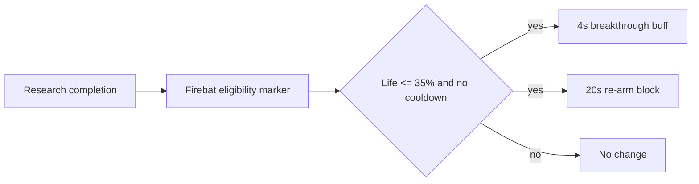

# Cooperation Underused-Unit Rescue Technology Design

## Status and Scope

| Item | Value |
| --- | --- |
| Status | Design baseline; not implemented or balance-validated |
| Source | `docs/plans/deep-research-report (3).md` |
| In scope | Four source proposals: Raynor, Swann, Kerrigan, and Zagara |
| Out of scope | The remaining 14 Co-op commanders, import-ready XML, and a production balance claim |
| Intended consumers | Commander-mod implementers, map-adapter implementers, and balance-test owners |

This document turns the supplied research draft into an implementation-ready
design baseline. It preserves the useful design intent while separating three
different kinds of statements:

- **Design**: an approved direction to evaluate, not a claim about live Co-op.
- **Static verification required**: a catalog id, inheritance path, or schema
  field that must be checked in the target package before implementation.
- **Runtime validation required**: a balance or gameplay outcome that cannot be
  established from source inspection.

The draft contains four actual commander proposals, not a complete 18-commander
catalog. This specification deliberately records that gap instead of treating
placeholders as completed design work.

## Design Objective

Each rescue technology should restore a narrow tactical role for an underused
unit without replacing the commander's defining army, calldown, hero, or macro
mechanic. The preferred mechanism is a bounded, conditional benefit rather
than a permanent increase to all combat statistics.

### Guardrails

1. Keep effects commander- and unit-specific. Do not generalize a rescue
   technology into a shared mod until at least two real consumers need the same
   behavior.
2. Prefer an existing data-driven effect chain. Use Galaxy only when the
   required event, target handoff, or state cannot be expressed by supported
   catalog objects.
3. Give every repeated trigger an explicit cooldown or a non-stacking behavior.
   The trigger condition must also define re-arm behavior.
4. Treat costs, commander-level gates, baseline values, and numeric targets as
   proposed values until the target commander package proves its actual catalog
   and the runtime test produces comparable evidence.
5. Keep canonical commander behavior in its commander mod. Map-specific
   compatibility belongs in a map adapter; it is not a reason to change a
   canonical package.

### Evidence Model

| Claim | Required evidence |
| --- | --- |
| Unit, ability, and behavior ids exist in the target composition | `static`: source catalog trace plus schema validation |
| Upgrade appears on the intended command card and is gated correctly | `runtime`: launched target composition and captured command-card/state evidence |
| Trigger fires once, respects cooldown, and affects only intended units | `runtime`: controlled assertion scenario and same-window ScriptError verdict |
| A unit becomes a viable optional choice without becoming mandatory | `runtime`: repeated matched combat/build tests with recorded inputs and outcomes |

## Coverage Matrix

| Commander | Rescue target | Proposed technology | Design status |
| --- | --- | --- | --- |
| Raynor | Firebat | Guerilla Breakthrough Protocol | Detailed candidate |
| Swann | Cyclone | Lock-On Overdrive | Detailed candidate; event implementation needed |
| Kerrigan | Hydralisk | Chitinous Plating Activator | Detailed candidate; numbers require reduction test |
| Zagara | Infestor | Symbiont Injection | Detailed candidate; event implementation needed |
| Nova, Han and Horner, Tychus, Mengsk | Not supplied | Not supplied | Research required |
| Abathur, Dehaka, Stukov, Stetmann | Not supplied | Not supplied | Research required |
| Artanis, Vorazun, Karax, Alarak, Fenix, Zeratul | Not supplied | Not supplied | Research required |

## Catalog and Naming Contract

The source draft's `UP_`, `BHV_`, `EFF_`, `VAL_`, and `REQ_` names are design
handles, not verified game ids. They use a legacy prefix convention and must be
namespaced to the owning mod before writing XML to prevent catalog collisions.

Suggested package-local form:

```text
<PackagePrefix>_<Commander>_<Unit>_<Role>
```

For example, a mod with the `CMRE` prefix could use
`CMRE_RaynorFirebatBreakthrough` for the upgrade and
`CMRE_RaynorFirebatBreakthroughBuff` for its behavior. The final prefix must
follow the target package's existing IDs; do not introduce a second naming
system in an established commander mod.

The implementation must verify the exact target unit and ability IDs in the
target package's `Base.SC2Data/GameData` catalog. Generic references such as
`Firebat`, `Cyclone`, `Hydralisk`, and `Infestor` identify design intent only;
Co-op variants can inherit from, rename, or replace base-game entries.

## Candidate Technology Catalog

| Commander | Unit role to restore | Candidate upgrade | Proposed gate and cost | Trigger and bounded effect | Key risk |
| --- | --- | --- | --- | --- | --- |
| Raynor | Firebat as a short-range breach unit | Guerilla Breakthrough Protocol | Level 10; 150M/150G | At <=35% life, once per 20s: 4s speed, attack-speed, and damage-taken buff | Becomes a general-purpose durable infantry core |
| Swann | Cyclone as a mobile sustained-damage option | Lock-On Overdrive | Level 8; 200M/150G | A Lock On kill grants a small, capped continuation benefit | Requires reliable kill ownership and target state handoff |
| Kerrigan | Hydralisk as a disposable pressure force, not a tank line | Chitinous Plating Activator | Level 7; 150M/100G | Under defined pressure, 5s defensive pulse, once per 30s | Armor proposal is too large without testing |
| Zagara | Infestor as a swarm-combat support unit | Symbiont Injection | Level 8; 100M/150G | Nearby allied unit death produces a rate-limited enemy pulse and allied haste | Death-heavy loops can scale without a strict cap |

M means minerals and G means vespene gas. Commander-level gates are only
applicable if the target composition has a verified way to expose that
progression; a normal `CRequirement` does not, by itself, prove access to a
Co-op commander level.

## Raynor: Guerilla Breakthrough Protocol

### Design Intent

Firebats should have a situational role at the front of a Raynor infantry push:
they create a short breach window after reaching critical health, rather than
becoming permanently durable or replacing Marines and Marauders.

### Candidate Contract

| Field | Proposed value | Verification note |
| --- | --- | --- |
| Upgrade handle | `UP_RAY_FIREBAT_BREAKTHROUGH` | Rename to the target package convention |
| Trigger | Life percent <= 35% | Define whether it triggers on threshold crossing only |
| Behavior | `BHV_RAY_FIREBAT_LAST_STAND` | Use a non-stacking buff with a 4s duration |
| Effect | +25% move speed, +15% attack speed, 15% damage reduction | Confirm supported behavior modifications in the actual schema/catalog |
| Re-arm | 20s | Must start only after activation; damage over time must not retrigger it |
| Cost | 150M/150G | Balance candidate, not an established price |

### Data-First Implementation Shape

Use a target-package upgrade/research path to grant an owner or unit marker.
From that marker, a periodic or damage-response effect chain should test the
life threshold and absence of the cooldown behavior, then apply both the active
buff and cooldown buff. The concrete behavior, effect, and validator subtypes
must be copied from a known working pattern in the target package and validated
against `catalogsData.xsd`.



### Acceptance Tests

1. A full-health Firebat receives no bonus.
2. Crossing the threshold produces one buff instance and one cooldown marker.
3. Repeated damage during the 4s window does not stack or refresh the active
   buff.
4. Healing above 35% does not clear the cooldown.
5. A mixed Marine/Marauder/Medic control group retains its normal behavior.

## Swann: Lock-On Overdrive

### Design Intent

The proposal aims to reduce Lock On's wasted time against disposable targets.
It must not turn Lock On into uncontrolled multi-target damage or make Cyclones
replace the commander's tank and air roles.

### Candidate Contract

| Field | Proposed value | Verification note |
| --- | --- | --- |
| Upgrade handle | `UP_SWANN_CYCLONE_OVERDRIVE` | Rename to the target package convention |
| Qualifying event | A Cyclone's active Lock On kills its target | Verify ability, effect, and kill-owner IDs |
| Reward | +3s continuation and +15% Lock On damage | Cap the continuation; do not automatically retarget without an explicit design decision |
| Cooldown | Inherit Lock On cooldown initially | Re-evaluate only after baseline runtime measurement |
| Cost | 200M/150G | Balance candidate |

### Implementation Decision

The draft described an event trigger. That is appropriate only if the data
catalog cannot reliably identify both the Lock On source and its killed target.
Before adding Galaxy, inspect the target ability's existing persistent/effect
chain and look for a data-driven kill or behavior-removal hook. If Galaxy is
required, it must store a unit-local marker when Lock On begins, validate the
marker and owner at death, apply a capped behavior to the original Cyclone, and
clear stale markers on cancel, death, or timeout.

The phrase "automatically switch target" is intentionally excluded from the
baseline. It changes the player's targeting contract and needs a separate,
runtime-tested design decision.

### Acceptance Tests

1. Killing a target with an ordinary weapon produces no reward.
2. Killing the active Lock On target produces one reward for the originating
   Cyclone only.
3. Cancelled Lock On, a killed Cyclone, and an expired Lock On produce no late
   reward.
4. Consecutive qualifying kills cannot exceed the documented cap.
5. Boss-target time-to-kill and a mixed-wave clear rate remain inside the
   agreed balance envelope.

## Kerrigan: Chitinous Plating Activator

### Design Intent

Hydralisks receive a short defensive pulse while under defined pressure. The
goal is to preserve their ability to keep firing in a fragile army, not to
convert them into a durable frontline core.

### Candidate Contract

| Field | Proposed value | Verification note |
| --- | --- | --- |
| Upgrade handle | `UP_KER_HYDRALISK_PLATING` | Rename to the target package convention |
| Trigger | Life <=50% after recent enemy damage | "Near melee unit" is ambiguous; use a measurable condition |
| Active behavior | 5s defensive pulse | Must be non-stacking and paired with cooldown state |
| Initial test range | +2 to +4 armor *or* 10% damage reduction | The source's +20 armor is not a safe starting value |
| Re-arm | 30s | Runtime-test against healing and repeated AOE |
| Cost | 150M/100G | Balance candidate |

### Rationale for the Revised Test Range

Armor interacts with rapid low-damage attacks and can reduce incoming damage far
more than a flat percentage reduction. A temporary +20 armor proposal cannot be
treated as a minor survivability buff. Begin with a smaller, single defensive
axis, record effective health and time alive against representative attack
types, then adjust from measured outcomes.

### Acceptance Tests

1. The pulse triggers once from the chosen threshold/pressure condition.
2. Ambient damage, self-damage, and allied damage do not qualify.
3. The pulse neither stacks nor refreshes before re-arm.
4. The measured survival gain is compared separately against low-damage swarms,
   burst attacks, and armor-piercing damage.
5. The upgraded army remains meaningfully weaker at holding a line than a
   purpose-built defensive composition.

## Zagara: Symbiont Injection

### Design Intent

An Infestor near a collapsing swarm converts a limited amount of attrition into
a brief local counterattack window. It should reward positioning, not make
disposable unit loss an unlimited damage engine.

### Candidate Contract

| Field | Proposed value | Verification note |
| --- | --- | --- |
| Upgrade handle | `UP_ZAG_INFESTOR_SYMBIOSIS` | Rename to the target package convention |
| Qualifying event | Allied, non-temporary Zerg combat unit dies within 5 range | Verify owner, alliance, category, and temporary-unit filters |
| Enemy result | Small area-damage pulse | Start below the source's 60-damage proposal and test by enemy type |
| Ally result | 5s local attack-speed buff | Must be non-stacking or refresh-only |
| Global per-Infestor cap | One trigger per 30s | Needed to stop death-loop amplification |
| Cost | 100M/150G | Balance candidate |

### Implementation Decision

This mechanism requires an event source with access to the dead ally, the
nearby Infestor, and nearby recipients. Prefer a supported data-driven death
response if the target package already has one. Otherwise, implement a narrow
Galaxy trigger owned by the commander package. It must filter unit ownership,
alliance, race/category, distance, and temporary or summoned units before it
applies the pulse. It must select a deterministic Infestor policy when more
than one eligible Infestor is nearby, such as nearest eligible Infestor only.

### Acceptance Tests

1. Enemy, neutral, non-Zerg, temporary, and out-of-range deaths do not trigger
   the effect.
2. A qualifying death selects exactly one eligible Infestor.
3. Multiple deaths inside the cooldown do not emit additional pulses.
4. Allies receive at most the documented haste behavior; overlapping Infestors
   do not multiply attack speed.
5. A fixed swarm-wave test records both trigger count and total added damage.

## Implementation Sequence

1. Select one commander package and verify its current source branch, write
   scope, composition manifest, and Co-op dependencies.
2. Trace the real target unit, its research location, its relevant ability, and
   existing behaviors/effects in `Base.SC2Data/GameData`.
3. Copy the nearest working pattern into a package-local feature file; register
   it through that package's existing `GameData.xml` include structure.
4. Validate the precise XML against `catalogsData.xsd`; do not use illustrative
   field labels from this document as schema names.
5. Run the package's static catalog/dependency checks.
6. Execute a deterministic control scenario for the trigger, cooldown, target
   filters, and non-stacking contract.
7. Launch only through an approved `tools/launchers/` script. Capture launcher
   readiness, live assertion results, and the same-window ScriptError verdict.
8. Run matched baseline versus upgrade tests before changing any proposed
   number. Record input composition, enemy composition, map, difficulty,
   timing, result, and build/package hashes.

## Balance Test Protocol

### Common Rules

- Use the same map, difficulty, enemy composition, player upgrades, controls,
  and observation window for baseline and candidate runs.
- Run enough repetitions to distinguish a consistent change from pathing or
  targeting variation. Record every run; do not discard losses without a
  documented external cause.
- Measure the rescue unit's contribution separately from whole-army performance.
  A better clear time alone is insufficient evidence that the target unit became
  a meaningful optional choice.
- Treat the following initial envelopes as hypotheses: a 10-15% whole-army DPS
  change and a 20-30% target-unit survival change. They are review thresholds,
  not pass criteria, until each commander's baseline is measured.

### Scenario Matrix

| Candidate | Control scenario | Primary measurements | Failure signals |
| --- | --- | --- | --- |
| Raynor Firebat | High-AOE mixed ground wave | activations, Firebat lifetime, army losses | permanent uptime, Marine/Marauder replacement |
| Swann Cyclone | disposable target wave plus armored boss | qualifying kills, Lock On uptime, boss time-to-kill | uncapped chaining or boss damage spike |
| Kerrigan Hydralisk | low-damage swarm, burst wave, and piercing attack | active-window effective health, deaths, trigger count | armor makes Hydralisks a reliable tank line |
| Zagara Infestor | controlled friendly-death wave | selected Infestor, pulses, affected units, added damage | multiple Infestors multiply effects or summoned-unit loop |

## Deliverables for a Later Implementation Stage

The implementation stage should produce, at minimum:

- One scoped commander package change per candidate, with no unrelated map or
  commander edits.
- Source-catalog trace and schema validation output.
- A deterministic scenario/manifest that identifies the technology and all
  trigger inputs.
- Static, simulator, and runtime evidence kept separately.
- A same-window ScriptError verdict for every live launch.
- A results table that records accepted, revised, or rejected numbers.

## Open Research Items

1. Validate the actual Co-op unit, ability, research, and behavior IDs in the
   intended commander packages; the supplied report does not provide those
   catalog traces.
2. Research one unit problem and one non-overlapping rescue role for each of the
   remaining 14 commanders before claiming a complete catalog.
3. Establish an explicit policy for commander-level unlocks in the target
   composition. Level gates may be inappropriate if the project distributes
   content without Blizzard's progression system.
4. Decide whether the four candidate technologies belong to a new balance mod,
   existing canonical commander mods, or pairing-specific adapters. The answer
   depends on actual consumer scope and cannot be inferred from this draft.
5. Source and cite community/meta claims before using them as a balance premise.
   The supplied report names community sources but provides no stable links,
   dates, build versions, or data extracts.

## Traceability

| Source material | Normalized outcome |
| --- | --- |
| Executive summary and design rules | Scope, guardrails, and evidence model |
| Four commander example chapters | Candidate contracts and acceptance tests |
| Technology catalog, editor notes, and test sections | Naming contract, implementation order, and balance protocol |
| Roadmap and placeholders | Explicit coverage gap and later-stage deliverables |

This specification is intentionally a design artifact. It does not certify that
any source number, community claim, catalog handle, or gameplay result is true
in the current SC2 build. Those claims require the evidence paths defined above.
